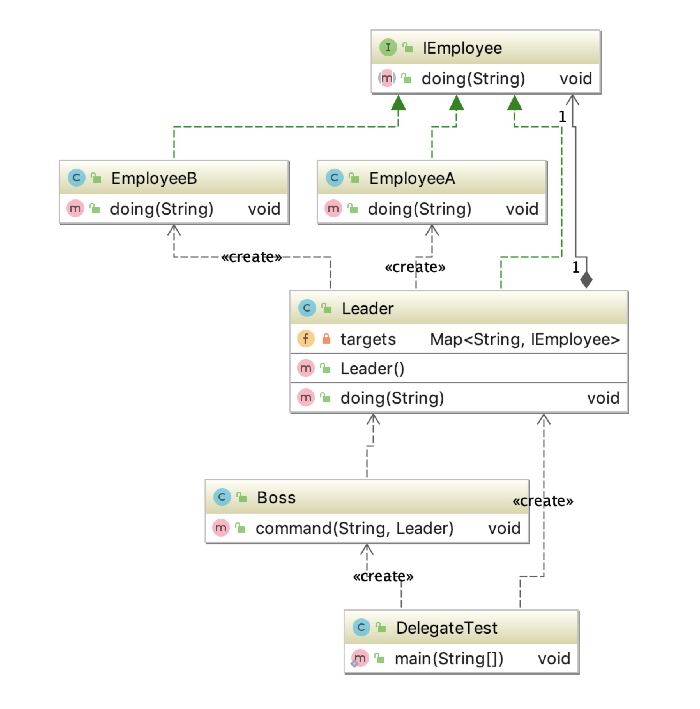

# 06 - 委派模式

这种模式并不是GOF23中的设计模式，但是在Spring源码中使用相当的多，比如大家熟知的dispatchServlet就是使用到了委派模式。委派模式的基本作用就是负责任务的调度和分配任务，与代理模式很相似，可以看做是一种特殊情况下的静态dialing的全权代理，需要注意的是代理模式注重过程，委派模式注重结果。



下面给出我们在初学servlet的时候写的很挫的代码，这里可以认为是委派模式的运用案例
```java
public class DispatcherServlet extends HttpServlet{
  private void doDispatch(HttpServletRequest request, HttpServletResponse response) throws Exception {
    String uri = request.getRequestURI();
    String mid = request.getParameter("mid");
    if("getMemberById".equals(uri)){
      new MemberController().getMemberById(mid);
    }else if("getOrderById".equals(uri)){
      new OrderController().getOrderById(mid);
    }else if("logout".equals(uri)){
      new SystemController().logout();
    }else {
      response.getWriter().write("404 Not Found!!");
    } 
  }
  protected void service(HttpServletRequest req, HttpServletResponse resp) throws ServletException, IOException {
    try {
      doDispatch(req,resp);
    } catch (Exception e) { 
      e.printStackTrace();
    } 
  }
}
```