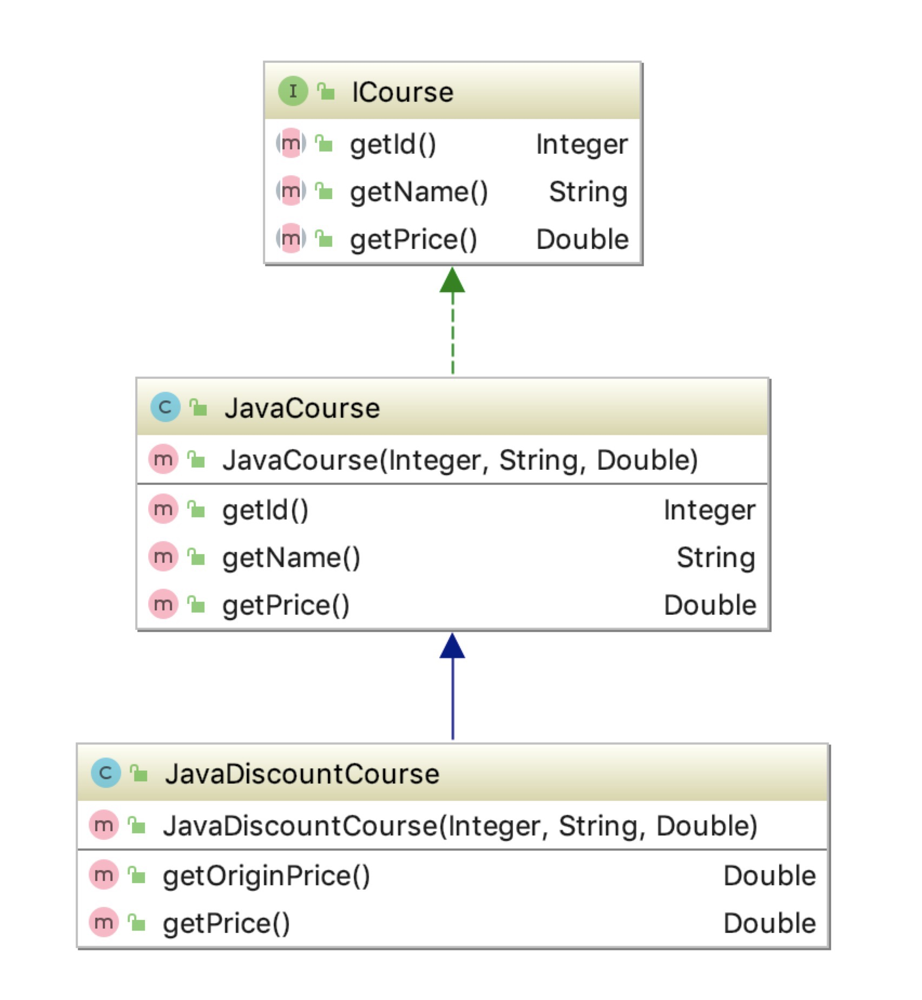
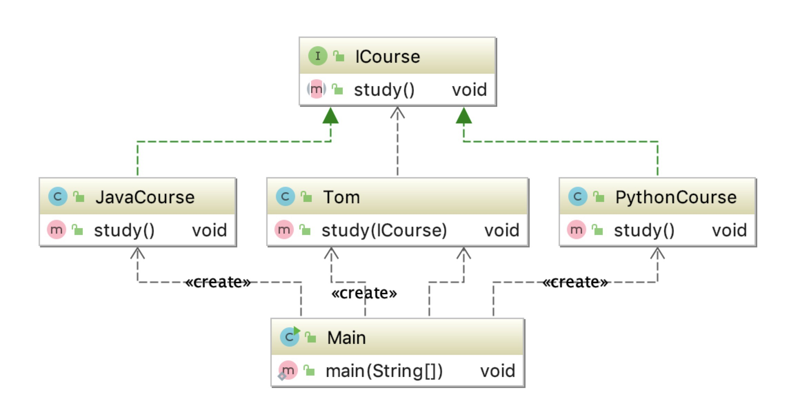
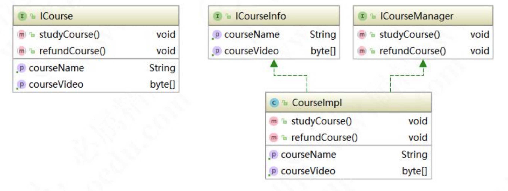
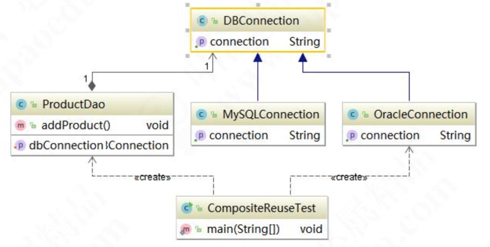

# 01 - 软件架构设计的七大设计原则

## 开闭原则

开闭原则(Open-Closed Principle, OCP)是指一个软件实体如类、模块和函数应该`对扩展开放`，`对修改关闭`。所谓的开闭，正是对扩展和修改行为的一个原则，强调的是`用抽象架构框架，用实现扩展细节`，可以提高软件系统的可复用性和可维护性，指导和帮助开发者建立稳定灵活的系统。

举例：现在有一个 java 课程活动，价格优惠，如果直接修改 javaCourse 的话，则会存在一定的风险，使用继承的方式能够在不影响原有代码的前提下实现价格优惠。

## 依赖倒置原则

依赖倒置原则(Dependence Inversion Principle,DIP)是指设计代码结构时，`高层模块不应该依赖底层模块`，二者都应该依赖其抽象。`抽象不应该依赖细节;细节应该依赖 抽象`。通过依赖倒置，可以`减少类与类之间的耦合性`，`提高系统的稳定性`，`提高代码的 可读性和可维护性`，并能够`降低修改程序所造成的风险`。

举例：在学过程中我们一般是先挑选其中一个课程进行学习，但是随着学习上瘾，后面想要学习新的课程时。只需要新增一个类并且实现对应的学习 stidy()方法即可。

## 单一职责原则

单一职责(Simple Responsibility Pinciple，SRP)是指不要存在多于一个导致类变更 的原因。假设我们有一个 Class 负责两个职责，一旦发生需求变更，修改其中一个职责的逻辑代码，有可能会导致另一个职责的功能发生故障。出现这种问题的时候可以给两个职责分别两个 class 进行实现并做到解耦。这样的设计，可以降低类的复杂度，提高类的 可读性，提高系统的可维护性，降低变更引起的风险。

## 接口隔离原则

接口隔离原则(Interface Segregation Principle, ISP)是指用多个专门的接口，而不使用单一的总接口，客户端不应该依赖它不需要的接口。这个原则指导我们在设计接口时 应当注意一下几点:

1. 一个类对一类的依赖应该建立在最小的接口之上。
2. 建立单一接口，不要建立庞大臃肿的接口。
3. 尽量细化接口，接口中的方法尽量少(不是越少越好，一定要适度)。

接口隔离原则符合我们常说的高内聚低耦合的设计思想，从而使得类具有很好的可读性、 可扩展性和可维护性。我们在设计接口的时候，要多花时间去思考，要考虑业务模型，包括以后有可能发生变更的地方还要做一些预判。所以，对于抽象，对业务模型的理解 是非常重要的。

## 迪米特法则

迪米特原则(Law of Demeter LoD)是指一个对象应该对其他对象保持最少的了解，又 叫最少知道原则(Least Knowledge Principle,LKP)，尽量降低类与类之间的耦合。

迪米特原则主要强调只和朋友交流，不和陌生人说话。出现在成员变量、方法的输入、输 出参数中的类都可以称之为成员朋友类，而出现在方法体内部的类不属于朋友类。

## 里氏替换原则

里氏替换原则(Liskov Substitution Principle,LSP)是指如果对每一个类型为 T1 的对 象 o1,都有类型为 T2 的对象 o2,使得以 T1 定义的所有程序 P 在所有的对象 o1 都替换成 o2 时，程序 P 的行为没有发生变化，那么类型 T2 是类型 T1 的子类型。

定义看上去还是比较抽象，我们重新理解一下，可以理解为一个软件实体如果适用一个 父类的话，那一定是适用于其子类，所有引用父类的地方必须能透明地使用其子类的对 象，子类对象能够替换父类对象，而程序逻辑不变。

引申含义:子类可以扩展父类的功能，但不能改变父类原有的功能。

1. 子类可以实现父类的抽象方法，但不能覆盖父类的非抽象方法。
2. 子类中可以增加自己特有的方法。
3. 当子类的方法重载父类的方法时，方法的前置条件(即方法的输入/入参)要比父类 方法的输入参数更宽松。
4. 当子类的方法实现父类的方法时(重写/重载或实现抽象方法)，方法的后置条件(即 方法的输出/返回值)要比父类更严格或相等。

使用里氏替换原则有以下优点:

1. 约束继承泛滥，开闭原则的一种体现。
2. 加强程序的健壮性，同时变更时也可以做到非常好的兼容性，提高程序的维护性、扩展性。降低需求变更时引入的风险。

## 合成复用原则

合成复用原则(Composite/Aggregate Reuse Principle,CARP)是指尽量使用对象组 合(has-a)/聚合(contanis-a)，而不是继承关系达到软件复用的目的。可以使系统更加灵 活，降低类与类之间的耦合度，一个类的变化对其他类造成的影响相对较少。

继承我们叫做白箱复用，相当于把所有的实现细节暴露给子类。组合/聚合也称之为黑箱 复用，对类以外的对象是无法获取到实现细节的。要根据具体的业务场景来做代码设计， 其实也都需要遵循 OOP 模型。

## 小结

设计原则虽然是前辈们总结出来的通用实现方法，值得学习和借鉴，但是我们在实际开发过程中要考虑到人力、时间、成本、质量，并不一定要刻意的追求完美，做到取舍平衡，这样能够协调业务开发与代码设计，做到优雅的代码结构。
