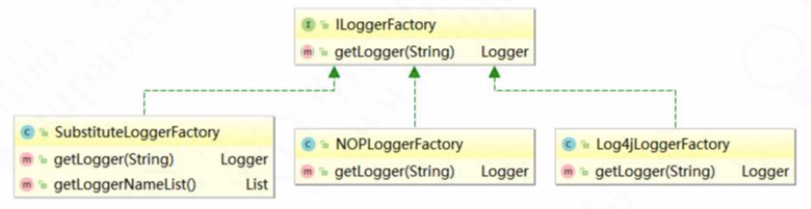
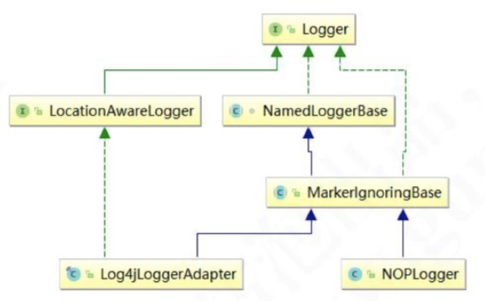
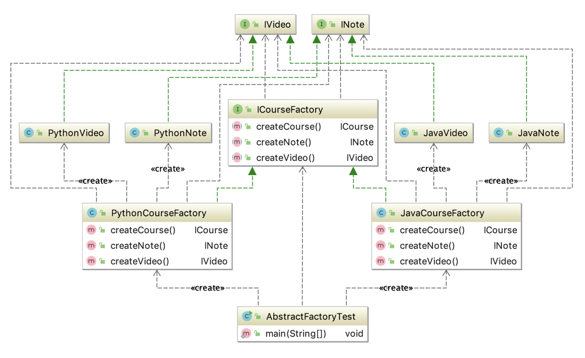

# 02 - 工厂模式

## 简单工厂

简单工厂模式(Simple Factory Pattern)是指由一个工厂对象决定创建出哪一种产品类的实例

```java
// 工厂方法代码
public ICourse create(Class<? extends ICourse> clazz){ try {
if (null != clazz) {
return clazz.newInstance();
       }
    }catch (Exception e){
       e.printStackTrace();
    }
return null;
}

// 调用代码
public static void main(String[] args) {
  CourseFactory factory = new CourseFactory();
  ICourse course = factory.create(JavaCourse.class);
  course.record();
}
```

工厂方法缺点：工厂类的职责相对过重，不易于扩展过于复杂的产品结构

## 工厂方法模式

工厂方法模式(Fatory Method Pattern)是指定义一个创建对象的接口，但让实现这个接口的类来决定实例化哪个类，工厂方法让类的实例化推迟到子类中进行。在工厂方法 模式中用户只需要关心所需产品对应的工厂，无须关心创建细节，而且加入新的产品符 合开闭原则。

```java
public abstract class ICourseFactory {
    public void preCreate() {
//        创建对象前的预处理工作
    }
    public abstract ICourse create();
}

public class JavaCourseFactory extends ICourseFactory {
    @Override
    public ICourse create() {
        return new JavaCourse();
    }
}

public class PythonCourseFactory extends ICourseFactory {
    @Override
    public ICourse create() {
        return new PythonCourse();
    }
}

public class FactoryMethodTest {
    public static void main(String[] args) {
        ICourseFactory factory = new PythonCourseFactory();
        ICourse iCourse = factory.create();
        iCourse.record();
    }
}

```




工厂方法适用于以下场景:

1. 创建对象需要大量重复的代码。
2. 客户端(应用层)不依赖于产品类实例如何被创建、实现等细节。
3. 一个类通过其子类来指定创建哪个对象。

工厂方法也有缺点:

1. 类的个数容易过多，增加复杂度。
2. 增加了系统的抽象性和理解难度。

## 抽象工厂模式

抽象工厂模式(Abastract Factory Pattern)是指提供一个创建一系列相关或相互依赖对象的接口，无须指定具体的类。 客户端(应用层)不依赖于产品类实例如何被创建、实现等细节，强调的是一系列相关的产品对象(属于同一产品族)一起使用创建对 象需要大量重复的代码。需要提供一个产品类的库，所有的产品以同样的接口出现，从 而使客户端不依赖于具体实现



抽象工厂缺点：
1、规定了所有可能被创建的产品集合，产品族中扩展新的产品困难，需要修改抽象工厂 的接口。
2、增加了系统的抽象性和理解难度。

```java
// Pool 抽象类

/**
*   自定义连接池 getInstance()返回 POOL 唯一实例,第一次调用时将执行构造函数
*   构造函数 Pool()调用驱动装载 loadDrivers()函数;连接池创建 createPool()函数 loadDrivers()装载驱动 *   createPool()建连接池 getConnection()返回一个连接实例 getConnection(long time)添加时间限制
*   freeConnection(Connection con)将 con 连接实例返回到连接池 getnum()返回空闲连接数
*   getnumActive()返回当前使用的连接数
*
*/
public abstract class Pool {
public String propertiesName = "connection-INF.properties";
private static Pool instance = null; // 定义唯一实例
/**
* 最大连接数 */
protected int maxConnect = 100; // 最大连接数
/**
* 保持连接数 */
protected int normalConnect = 10; // 保持连接数
/**
* 驱动字符串 */
protected String driverName = null; // 驱动字符串
/**
* 驱动类 */
protected Driver driver = null; // 驱动变量
/**
* 私有构造函数,不允许外界访问 */
protected Pool() {
  try {
    init();
    loadDrivers(driverName);
  }catch(Exception e) {
    e.printStackTrace(); }
  }
/**
* 初始化所有从配置文件中读取的成员变量成员变量 */
private void init() throws IOException {
  InputStream is = Pool.class.getResourceAsStream(propertiesName);
  Properties p = new Properties();
  p.load(is);
  this.driverName = p.getProperty("driverName");
  this.maxConnect = Integer.parseInt(p.getProperty("maxConnect"));
  this.normalConnect = Integer.parseInt(p.getProperty("normalConnect"));
}
/**
* 装载和注册所有 JDBC 驱动程序
* @param dri 接受驱动字符串
*/
protected void loadDrivers(String dri) { String driverClassName = dri;
  try {
    driver = (Driver) Class.forName(driverClassName).newInstance();
    DriverManager.registerDriver(driver);
    System.out.println("成功注册 JDBC 驱动程序" + driverClassName);
  } catch (Exception e) {
    System.out.println("无法注册 JDBC 驱动程序:" + driverClassName + ",错误:" + e);
  }
}

/**
* 创建连接池 */
public abstract void createPool();
/** *
* (单例模式)返回数据库连接池 Pool 的实例 *
* @param driverName 数据库驱动字符串
* @return
* @throws IOException
* @throws   ClassNotFoundException
* @throws   IllegalAccessException
* @throws   InstantiationException
*/
public static synchronized Pool getInstance() throws IOException, InstantiationException, IllegalAccessException, ClassNotFoundException {
  if (instance == null) {
      instance.init();
      instance = (Pool) Class.forName("org.e_book.sqlhelp.Pool").newInstance();
      return instance;
    }
  }

  /**
  * 获得一个可用的连接,如果没有则创建一个连接,且小于最大连接限制 * @return
  */
  public abstract Connection getConnection();
  /**
  * 获得一个连接,有时间限制
  * @param time 设置该连接的持续时间(以毫秒为单位) * @return
  */
  public abstract Connection getConnection(long time);
  /**
  * 将连接对象返回给连接池
  * @param con 获得连接对象 */
  public abstract void freeConnection(Connection con);
  /**
  * 返回当前空闲连接数 * @return
  */
  public abstract int getnum();
  /**
  * 返回当前工作的连接数 * @return
  */
  public abstract int getnumActive();
  /**
  * 关闭所有连接,撤销驱动注册(此方法为单例方法) */
  protected synchronized void release() { // /撤销驱动
    try {
      DriverManager.deregisterDriver(driver);
      System.out.println("撤销 JDBC 驱动程序 " + driver.getClass().getName()); } catch (SQLException e) {
      System.out.println("无法撤销 JDBC 驱动程序的注册:" + driver.getClass().getName());
    }
  }
}

```

```java
// DBConnectionPool
/**
 * 数据库链接池管理类
 */
public final class DBConnectionPool extends Pool {
    private static int num = 0;// 空闲连接数
    private static int numActive = 0;// 当前可用的连接数
    private static DBConnectionPool pool = null;// 连接池实例变量
    private int checkedOut; //正在使用的连接数
    /**
     * 存放产生的连接对象容器
     */
    private Vector<Connection> freeConnections = new Vector<Connection>(); //存放产生的连接对象容器 private String passWord = null; // 密码
    private String url = null; // 连接字符串
    private String userName = null; // 用户名

    /**
     * 获得一个 数据库连接池的实例
     */
    private DBConnectionPool() {
        try {
            init();
            for (int i = 0; i < normalConnect; i++) { // 初始 normalConn 个连接 Connection c = newConnection();
                if (c != null) {
                    freeConnections.addElement(c); //往容器中添加一个连接对象
                    num++; //记录总连接数 }
                }
            }catch(Exception e)
            {
                e.printStackTrace();
            }
        }
/**
 * 初始化
 * @throws IOException */
        private void init () throws IOException {
            InputStream is = DBConnectionPool.class.getResourceAsStream(propertiesName);
            Properties p = new Properties();
            p.load(is);
            this.userName = p.getProperty("userName");
            this.passWord = p.getProperty("passWord");
            this.driverName = p.getProperty("driverName");
            this.url = p.getProperty("url");
            this.driverName = p.getProperty("driverName");
            this.maxConnect = Integer.parseInt(p.getProperty("maxConnect"));
            this.normalConnect = Integer.parseInt(p.getProperty("normalConnect"));
        }
/**
 * 如果不再使用某个连接对象时,可调此方法将该对象释放到连接池 * @param con
 */
        public synchronized void freeConnection (Connection con){
            freeConnections.addElement(con);
            num++;
            checkedOut--;
            numActive--;
            notifyAll(); //解锁
        }
/**
 * 创建一个新连接 * @return
 */
        private Connection newConnection () {
            Connection con = null;
            try {
                if (userName == null) { // 用户,密码都为空 con = DriverManager.getConnection(url);
                } else {
                    con = DriverManager.getConnection(url, userName, passWord);
                }
                System.out.println("连接池创建一个新的连接");
            } catch (SQLException e) {
                System.out.println("无法创建这个 URL 的连接" + url);
                return null;
            }
            return con;
        }
/**
 * 返回当前空闲连接数 * @return
 */
        public int getnum () {
            return num;
        }
/**
 * 返回当前连接数 * @return
 */
        public int getnumActive () {
            return numActive;
        }
/**
 * (单例模式)获取一个可用连接
 * @return
 */
        public synchronized Connection getConnection () {
            Connection con = null;
            if (freeConnections.size() > 0) { // 还有空闲的连接
                num--;
                con = (Connection) freeConnections.firstElement();
                freeConnections.removeElementAt(0);
                try {
                    if (con.isClosed()) {
                        System.out.println("从连接池删除一个无效连接");
                        con = getConnection();
                    }
                } catch (SQLException e) {
                    System.out.println("从连接池删除一个无效连接");
                    con = getConnection();
                }
            } else if (maxConnect == 0 || checkedOut < maxConnect) { // 没有空闲连接且当前连接小于最大允许 值,最大值为 0 则不限制
                con = newConnection();
            }
            if (con != null) { // 当前连接数加 1 checkedOut++;
            }
            numActive++;
            return con;
        }
/**
 * 获取一个连接,并加上等待时间限制,时间为毫秒 * @param timeout 接受等待时间(以毫秒为单位) * @return
 */
        public synchronized Connection getConnection ( long timeout){
            long startTime = new Date().getTime();
            Connection con;
            while ((con = getConnection()) == null) {
                try {
                    wait(timeout); //线程等待
                } catch (InterruptedException e) {
                }
                if ((new Date().getTime() - startTime) >= timeout) {
                    return null; // 如果超时,则返回
                }
            }
            return con;
        }
/**
 * 关闭所有连接 */
        public synchronized void release () {
            try {
//将当前连接赋值到 枚举中
                Enumeration allConnections = freeConnections.elements(); //使用循环关闭所用连接
                while (allConnections.hasMoreElements()) {
//如果此枚举对象至少还有一个可提供的元素，则返回此枚举的下一个元素 Connection con = (Connection) allConnections.nextElement(); try {
                    con.close();
                    num--;
                } catch(SQLException e){
                    System.out.println("无法关闭连接池中的连接");
                }
            } freeConnections.removeAllElements();
            numActive = 0;
        } finally{
            super.release();
        }
    }

    /**
     * 产生数据连接池 * @return
     */
    public static synchronized DBConnectionPool getInstance() {
        if (pool == null) {
            pool = new DBConnectionPool();
        }
        return pool;
    }

    /**
     * 建立连接池
     */
    public void createPool() {
        pool = new DBConnectionPool();
        if (pool != null) {
            System.out.println("创建连接池成功");
        } else {
            System.out.println("创建连接池失败");
        }
    }
}

```
