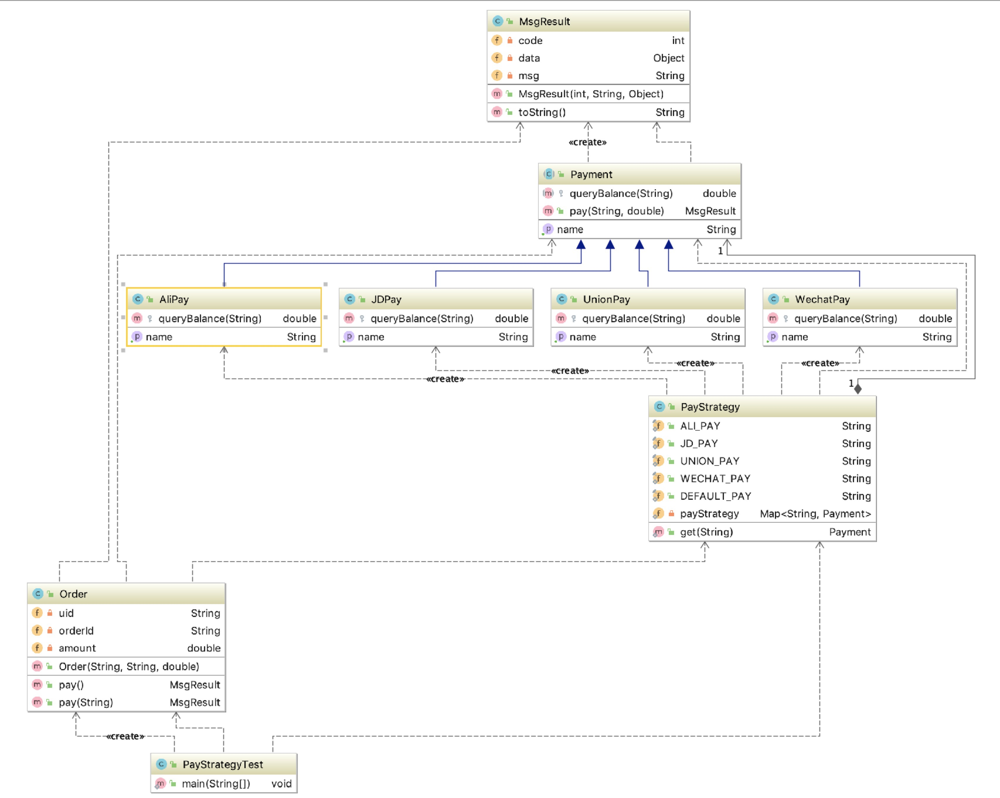

# 06 - 策略模式

策略模式是指定义了算法家族、分别封装，让他们彼此之间可以互相替换，此设计模式的主要是为了保证在切换算法时不会影响到用户

### 应用场景
1. 假如系统中有很多类，而他们的区别仅仅在于他们的行为不同
2. 一个系统需要动态地在几种算法中选择一种



```java
public class DispatcherServlet extends HttpServlet {
    private List<Handler> handlerMapping = new ArrayList<Handler>();

    public void init() throws ServletException {
        try {
            Class<?> memberControllerClass = MemberController.class;
            handlerMapping.add(new Handler()
                    .setController(memberControllerClass.newInstance())
                    .setMethod(memberControllerClass.getMethod("getMemberById", new Class[]{String.class}))
                    .setUrl("/web/getMemberById.json"));
        } catch (Exception e) {
        }
    }

    private void doDispatch(HttpServletRequest request, HttpServletResponse response) {
        //1、获取用户请求的 url, 如果按照 J2EE 的标准、每个 url 对对应一个 Serlvet，url 由浏览器输入 
        String uri = request.getRequestURI();
        //2、Servlet 拿到 url 以后，要做权衡(要做判断，要做选择), 根据用户请求的 URL，去找到这个 url 对应的某一个 java 类的方法
        //3、通过拿到的 URL 去 handlerMapping(我们把它认为是策略常量) 
        Handler handle = null;
        for (Handler h : handlerMapping) {
            if (uri.equals(h.getUrl())) {
                handle = h;
                break;
            }
        }
        //4、将具体的任务分发给 Method(通过反射去调用其对应的方法) 
        Object object = null;
        try {
            object = handle.getMethod().invoke(handle.getController(), request.getParameter("mid"));
        } catch (IllegalAccessException e) {
            e.printStackTrace();
        } catch (InvocationTargetException e) {
            e.printStackTrace();
        }
        //5、获取到 Method 执行的结果，通过 Response 返回出去 //             
        response.getWriter().write();
    }

    protected void service(HttpServletRequest req, HttpServletResponse resp) throws ServletException, IOException {
        try {
            doDispatch(req, resp);
        } catch (Exception e) {
            e.printStackTrace();
        }
    }

    class Handler {
        private Object controller;
        private Method method;
        private String url;

        public Object getController() {
            return controller;
        }

        public Handler setController(Object controller) {
            this.controller = controller;
            return this;
        }

        public Method getMethod() {
            return method;
        }

        public Handler setMethod(Method method) {
            this.method = method;
            return this;
        }

        public String getUrl() {
            return url;
        }

        public Handler setUrl(String url) {
            this.url = url;
            return this;
        }
    }
}
```

### 优缺点
- 优点:
1. 策略模式符合开闭原则。
2. 避免使用多重条件转移语句，如 if...else...语句、switch 语句 3、使用策略模式可以提高
3. 算法的保密性和安全性
- 缺点: 
1. 客户端必须知道所有的策略，并且自行决定使用哪一个策略类。 
2. 代码中会产生非常多策略类，增加维护难度。